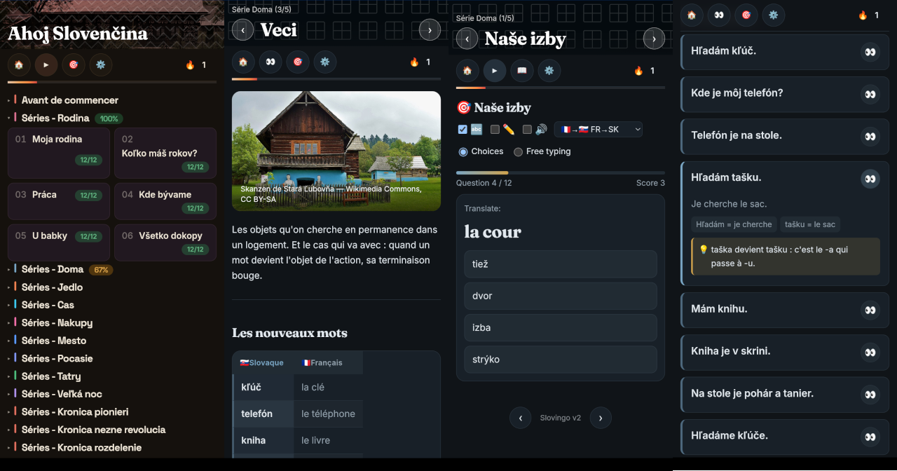

[French version](README_fr.md) [Slovak version](README_sk.md)

# Slovingo

Learn a language without an app, without an account, without a server. Just text files and a Python script that generates a mini website in html.

Directly available at **[www.lslinux.org/slovingo](https://www.lslinux.org/slovingo)**.

## 🎯 Why Slovingo

The well-known apps don't have Slovak courses. I tried Ling — not quite convinced (and it turns paid after the first course). So I made my own: I wanted to listen to words while reading them, and to write my own vocabulary/dialogue cards.

No account, no subscription, no app server that can vanish tomorrow. Just Markdown text files + a small Python script that turns them into a mini-site you can browse offline.



- Your progress is tracked locally (nothing is sent anywhere)
- A card shows vocabulary, grammar, audio — all clickable and pronounceable
- Click a sentence → translation + word-by-word breakdown + audio
- Multiple choice, fill-in-the-blanks, listening — auto-generated from the cards
- Once installed as a PWA, it keeps working offline even if lslinux.org were to disappear one day

## ⚠️ AI-generated content

The cards were written with AI assistance.

- **Slovak for French speakers**: reviewed and corrected as I go through the course myself.
- **French for Slovak speakers**: much harder for me to review properly (no native Slovak speaker on hand). If you spot a mistake, a PR or an issue is very welcome 🙏

## 🚀 To learn

- **[Slovak for French speakers](https://www.lslinux.org/slovingo/sk-fr/)** — *Ahoj Slovenčina!*
- **[French for Slovak speakers](https://www.lslinux.org/slovingo/fr-sk/)** — *Dis bonjour!*
- **Breton for French speakers** — an early-stage course, no text-to-speech available for it yet

Click, and you're good to go. No sign-up.

## 📚 To create a course in another language

Slovingo is a generic engine: one language = one `lang.json` file + Markdown cards.

A card is regular Markdown plus a few syntax tricks (the **SMD** format):

```markdown
# Basic vocabulary

| Learn french | Native |
|--------------|--------|
| Bonjour | …   |
| Merci   | …   |

! An example sentence
> Natural translation.
> Word1 = word1 translation
+ Grammar note if needed.
```

Nothing to touch in Python: everything language-dependent (voice, colors, title) lives in `lang.json`. Full format details in [Format-SMD.txt](docs/Format-SMD.txt).

```bash
git clone https://github.com/…/slovingo.git
cd slovingo
cp -r langs/sk-fr langs/my-language
python3 src/publish.py --lang-dir langs/my-language
```

## 🛠️ Install locally

```bash
git clone https://github.com/…/slovingo.git
cd slovingo
python3 src/publish.py --lang-dir langs/sk-fr
# Open langs/sk-fr/dist/index.html in your browser
```

Python 3.8+, zero external dependencies, runs anywhere (Linux/macOS/Windows). Details in [INSTALL.md](INSTALL.md).

## 🤝 Contributing

Contributions are welcome, especially reviewing and fixing the French course!

- **Fix/add a card**: fork → edit in `langs/<code>/fiches/` → test with `python3 src/publish.py --lang-dir langs/<code>` → PR
- **Report a bug**: open an issue (what's broken + browser/OS)
- **Suggest a language**: open an issue (language, ISO code, why it's missing elsewhere)

## 📝 License

The GitHub repo — engine, cards and exercises included — is under GPL v3, see [LICENSE](LICENSE). Outside the repo, you're free to license your own cards however you like (CC-BY, public domain…).

---

**Questions?** Open an issue, or just clone and try it. 🚀
